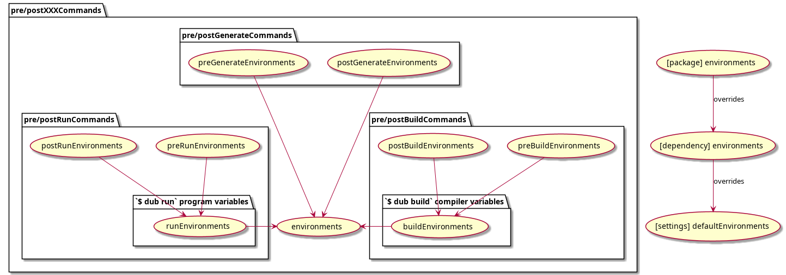

# User Settings

!!! note "Work-in-Progress Documentation"

    The content on this page is not yet fully finished.

    Tracking issue: <https://github.com/WebFreak001/dub-docs-v2/issues/19>

User/System-wide default settings can be specified in the DUB settings file. The DUB settings file is a JSON configuration file containing various default values that are otherwise hard-coded. Most settings can be overridden by their corresponding [command line switches](../cli-reference/dub.md).

Settings will be loaded from all of the following locations, in this order:

Windows:

1. `%ProgramData%\dub\settings.json`
2. `<dub executable folder>\..\etc\dub\settings.json`
3. `%APPDATA%\dub\settings.json`
4. `%ROOT_PACKAGE_DIR%\dub.settings.json`

POSIX:

1. `/var/lib/dub/settings.json`
2. `/etc/dub/settings.json` (only if DUB has been installed in `/usr/...`)
3. `<dub executable folder>/../etc/dub/settings.json`
4. `~/.dub/settings.json`
5. `$ROOT_PACKAGE_DIR/dub.settings.json`

The last item in each of these lists has the highest priority. All configuration files will be merged, with each specified property overriding the previously specified properties.

A settings.json file could look like this:

```json title="settings.json"
{
    "defaultArchitecture": "x86_64",
    "defaultCompiler": "ldc"
}
```

## General Settings

### `registryUrls`

**Type:** `string[]`

Search the given registry URL first when resolving dependencies. Can be specified multiple times. Available registry types:

- DUB: URL to DUB registry (default)
- Maven: URL to Maven repository + group id containing dub packages as artifacts. E.g. `mvn+http://localhost:8040/maven/libs-release/dubpackages`

Example:

```json title="settings.json"
{
    "registryUrls": [
        "https://registry.example.org"
    ]
}
```

For more information about custom registries, see [Registries](./registries.md).

### `skipRegistry`

**Type:** `string`

Sets a mode for skipping the search on certain package registry types:

- `none`: Search all configured or default registries (default)
- `standard`: Don't search the main registry (e.g. https://code.dlang.org/)
- `configured`: Skip all default and user configured registries
- `all`: Only search registries specified with --registry

### `customCachePaths`

**Type:** `string[]`

Additional paths that contain packages in subfolders with the pattern `"(name)-(version)/(name)/"`.

Can be used to provide prebuilt DUB libraries (e.g. for distribution package maintainers).
### `defaultCompiler`

**Type:** `string`

Specifies the compiler binary to use (can be a path).

Arbitrary pre- and suffixes to the identifiers below are recognized (e.g. `ldc2` or `dmd-2.063`) and matched to the proper compiler type: `dmd`, `gdc`, `ldc`, `gdmd`, `ldmd`
### `defaultArchitecture`

**Type:** `string`

Force a different architecture (e.g. `x86` or `x86_64`)
### `defaultLowMemory`

**Type:** `bool`

Enable the garbage collector for the compiler(dmd/ldc), reducing the compiler memory requirements but increasing compile times.

## Environment Variables

For **precedence rules** and also how to configure environment variables in packages and dependencies, see [environment variables](../dub-reference/environment_variables.md#user-specified-environment-variables).

The following diagram visually explains the hierarchy between the different environment variables described below:



### `defaultEnvironments`

Sets the keys in environments if they are not overriden by the dub recipe. Defines default environment variables used by all executable invocations. This has the lowest precedence.

### `defaultBuildEnvironments`

Sets the keys in buildEnvironments if they are not overriden by the dub recipe. Defines default environment variables used by build tools (compiler, linker), preBuildCommands, postBuildCommands, preGenerateCommands and postGenerateCommands invocations. Overrides keys from defaultEnvironments.

### `defaultRunEnvironments`

Sets the keys in runEnvironments if they are not overriden by the dub recipe. Defines default environment variables used by the built user program, preRunCommands and postRunCommands invocations. Overrides keys from defaultEnvironments.

### `defaultPreGenerateEnvironments`

Sets the keys in preGenerateEnvironments if they are not overriden by the dub recipe. Defines default environment variables used by preGenerateCommands invocations. Overrides keys from defaultEnvironments.

### `defaultPostGenerateEnvironments`

Sets the keys in postGenerateEnvironments if they are not overriden by the dub recipe. Defines default environment variables used by postGenerateCommands invocations. Overrides keys from defaultEnvironments.

### `defaultPreBuildEnvironments`

Sets the keys in preBuildEnvironments if they are not overriden by the dub recipe. Defines default environment variables used by preBuildCommands invocations. Overrides keys from defaultBuildEnvironments and defaultEnvironments.

### `defaultPostBuildEnvironments`

Sets the keys in postBuildEnvironments if they are not overriden by the dub recipe. Defines default environment variables used by postBuildCommands invocations. Overrides keys from defaultBuildEnvironments and defaultEnvironments.

### `defaultPreRunEnvironments`

Sets the keys in preRunEnvironments if they are not overriden by the dub recipe. Defines default environment variables used by preRunCommands invocations. Overrides keys from defaultRunEnvironments and defaultEnvironments.

### `defaultPostRunEnvironments`

Sets the keys in postRunEnvironments if they are not overriden by the dub recipe. Defines default environment variables used by postRunCommands invocations. Overrides keys from defaultRunEnvironments and defaultEnvironments.

### Example environments

```json title="settings.json"
{
    "defaultEnvironments": {
        "LOG_LEVEL": "INFO"
    },
    "defaultBuildEnvironments": {
        "NO_COLORS": "1"
    }
}
```